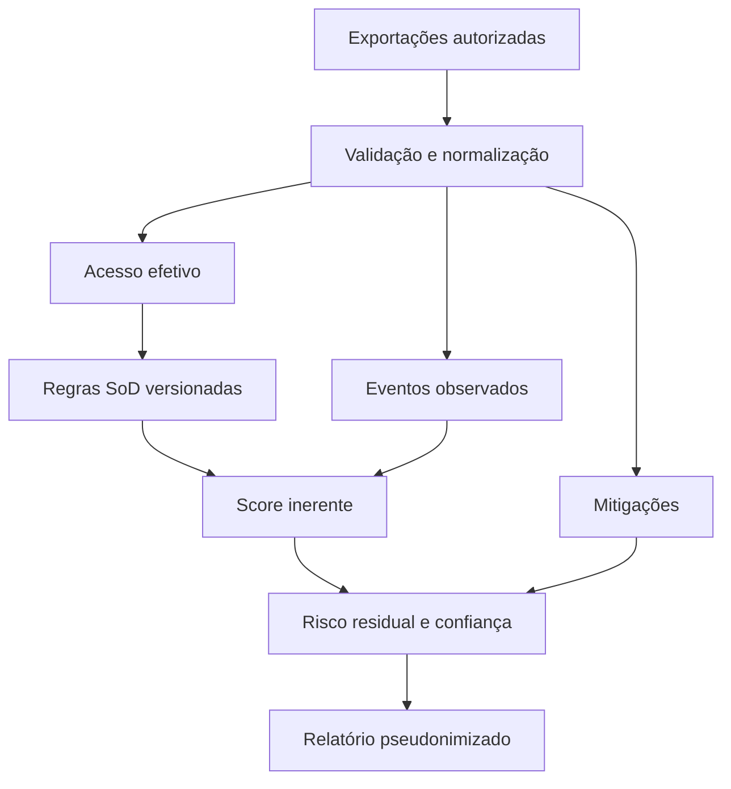

# Blueprint do MVP

## Objetivo

Priorizar conflitos de segregação de funções usando evidência offline, explicável e rastreável,
sem conexão com um sistema SAP.

## Fluxo

## Componentes

| Componente | Responsabilidade |
|---|---|
| `loader.py` | Segurança de caminhos, limites, CSV, JSON e validação |
| `analyzer.py` | Acesso efetivo, escopo, eventos e mitigações |
| `scoring.py` | Faixas e score agregado versionado |
| `reporting.py` | Pseudonimização, relatório e gravação atômica |
| `cli.py` | Interface de linha de comando |

## Fora do escopo da versão 0.1.0

- conexão RFC, OData ou banco de dados;
- extração direta de SUIM, SM20 ou tabelas SAP;
- mapeamento automático de transações para ações;
- regras Fiori, BTP ou conflitos entre sistemas;
- remediação ou provisionamento;
- conclusão automática de fraude ou conformidade.

## Próximas versões possíveis

1. validadores de exportações específicas do SUIM;
2. mapeamento configurável entre transações, objetos, atividades e ações;
3. correlação de fluxos P2P, O2C e R2R;
4. análise de usuários privilegiados e genéricos;
5. exportação CSV e SARIF;
6. matriz de referência para COBIT, NIST e controles SOX, sem conclusão automática.
